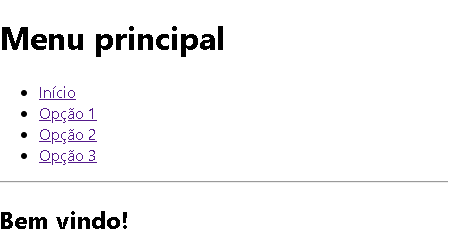

# Programa de exemplo de menu de opções com React.js.

## Descrição

- O projeto foi desenvolvido no VSCode deve ser chamado "menu_reactjs".
- Programa web utiliza a porta 5173.
- A pasta src contêm os fontes do projeto.
- Cada opção do menu é uma função.

## Dependências

- bootstrap,
- react-router-dom.

## Execução

   <pre><code>npm run dev</code></pre>

## Atualização

   Caso o diretório "node_modules" tenha sido apagado basta executar o comando npm a seguir para recriar a pasta e os arquivos das dependências.
   <pre><code>npm update</code></pre> 

## Arquivos do projeto em src

- App.jsx - Interface do programa.

## Menu de opções

