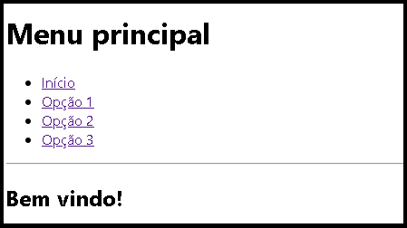

# Programa de exemplo de menu de opções com React.js.

- O projeto foi desenvolvido no VSCode deve ser chamado "menu_reactjs".
- Programa web utiliza a porta 3000.
- A pasta src contêm os fontes do projeto.
- Cada opção do menu é uma função.

- Execução:    
   <pre><code>npm start</code></pre>

- Atualização:

   Caso o diretório "node_modules" tenha sido apagado basta executar o comando npm a seguir para recriar a pasta e os arquivos das dependências.
   <pre><code>npm update</code></pre> 

- Arquivos em src:
   - App.js - Interface do programa.

- Menu de opções:

